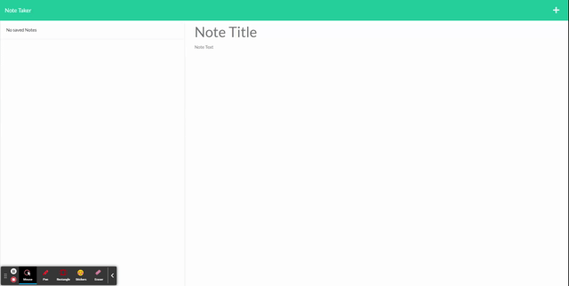

# Module 11 - Note Taker

## Description
This application takes your notes, you give it a title and some text, then you hit the save button(The thing that is square shaped on the top right, only appears when there is text), then the Note will be saved to the column on the left.
<h1 align="center">
    <a href="https://howling-zombie-72947.herokuapp.com/" target="_blank">
    Deployed Application
    </a>
</h1>

    

